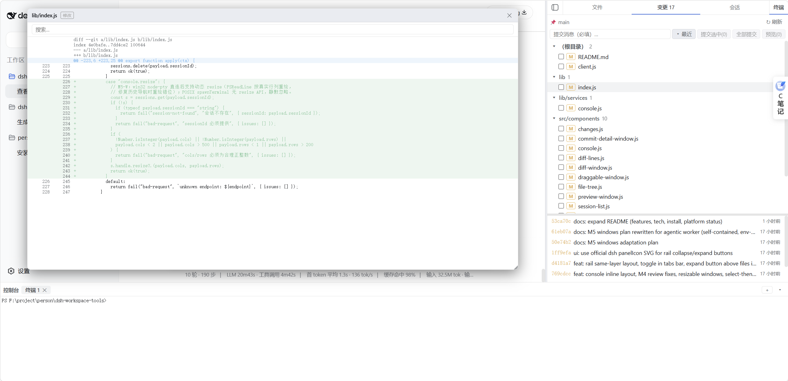

# dsh-workspace-tools

DSH（DeepSeek Harness）第三方插件：右侧工具侧边栏 —— Git 变更 / 文件浏览器 / PTY 控制台。



## 功能

- **文件**：懒加载文件树（隐藏 dotfiles）、过滤、单击选中、右键菜单（打开预览 / 复制绝对路径 / 发送到对话框）。
- **变更**：Git 变更列表（修改/新增/删除/重命名/未跟踪）、diff 窗口（可拖拽/缩放/搜索）、提交（单个或全部，必填提交消息）、提交历史（回退 `--mixed` / 查看提交详情 diff）。
- **预览**：文本（行号 + 语法高亮 + 搜索）与图片；窗口居中打开、可拖拽、可缩放。
- **会话**：会话列表（与 DSH 左侧栏同源）。
- **控制台**：底部 PTY 终端面板（多标签 xterm + WebSocket 输出流 + RPC 输入），可拖高、可收起（会话保留）。
  - POSIX：`ctx.subprocess.spawnTerminal`；Windows（M5-W）：dsh-subprocess 的 win32 inspector 未实现 → 直连 `node-pty`（conpty），shell 探测 pwsh 7 → Windows PowerShell → cmd。
- **主题**：终端与面板跟随 DSH 主题（读 `--dsw-alias-*` CSS 变量，`body[data-ds-dark-theme]` 切换时热更新 xterm 配色）。
- **布局**：右侧栏可收起为 56px 图标 rail（文件/变更/会话/终端），与主页面同层不遮挡；控制台与主内容同层。

## 技术要点

- **架构**：host 侧 `lib/`（RPC 端点 + WebSocket 泵 + git/fs/console 服务），client 侧 `src/`（React 组件，esbuild 打包为单文件 `client.js`）。
- **RPC 契约**：`(endpoint, payload)` → `{ok, value}` / `{ok, error}`；`sessionId` + cwd 校验（fail-closed）。
- **WS 协议**：client 发 masked 文本帧首帧（`{sessionId}`），host 回 PTY 输出 + `{"type":"exit"}` 退出帧；RFC6455 解析器。
- **控制台**：`ctx.subprocess.spawnTerminal`（POSIX）；Windows 直连 `node-pty`（conpty，插件根 `node_modules` junction → DSH profile 同实例；shell 探测 + PowerShell 系 `-NoLogo -NoExit` 参数，真机验证 2026-08-16）。

## 安装

```bash
npm install
node build.mjs        # 生成 client.js（xterm 等打包进 bundle）
node scripts/install.mjs   # 链接到 DSH profile + 写入 cordis.patch.yml（macOS symlink / Windows junction）
```

然后重启 DSH 服务（host 代码变更需重启；client.js 刷新即生效）。

## 开发

- 测试：`node --test`（85+ 用例，纯函数 + 集成 + bundle 加载契约）。
- 构建：`node build.mjs`（esbuild CJS wrapper；`react`/`@deepseek-ai/*` external，`@xterm/*` 打包，css 内联）。
- 设计文档：`docs/specs/2026-08-14-dsh-workspace-tools-design.md`。
- 里程碑计划：`docs/plans/`（M1 骨架 → M2 文件浏览器 → M3 变更/diff → M3b 预览 → M3c 变更 v2 → M3d 提交详情 → M4 控制台 → M5 Windows 适配）。

## 平台支持

| 平台 | 状态 |
|---|---|
| macOS | ✅ 完整可用（开发与验收平台） |
| Windows | ✅ 完整可用（M5-W）：文件/变更/预览/提交/控制台（node-pty conpty + 主题跟随）；junction 安装 |

## 许可

MIT
