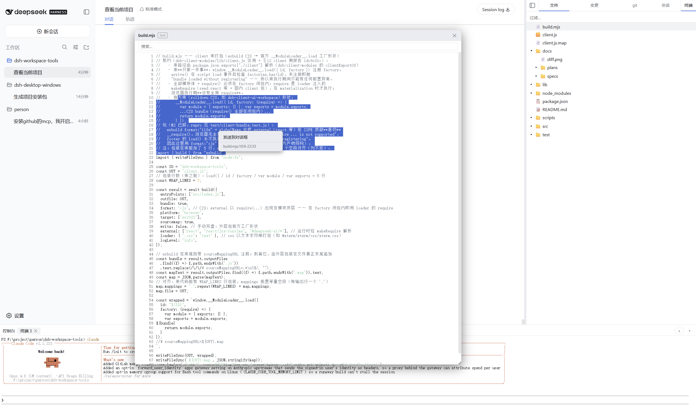
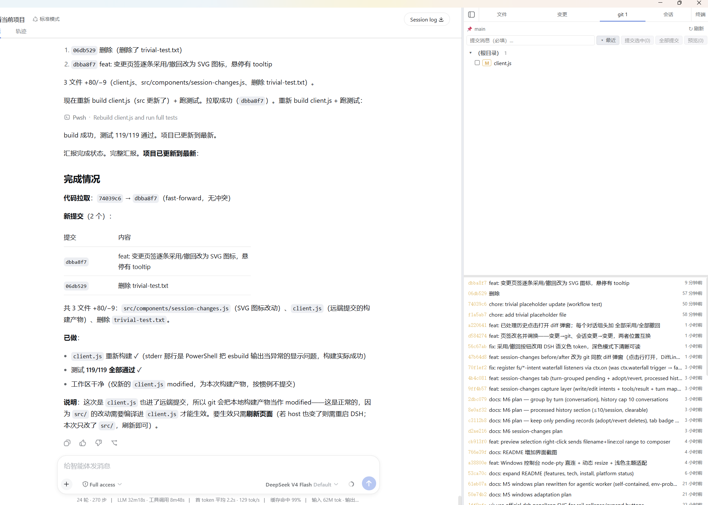
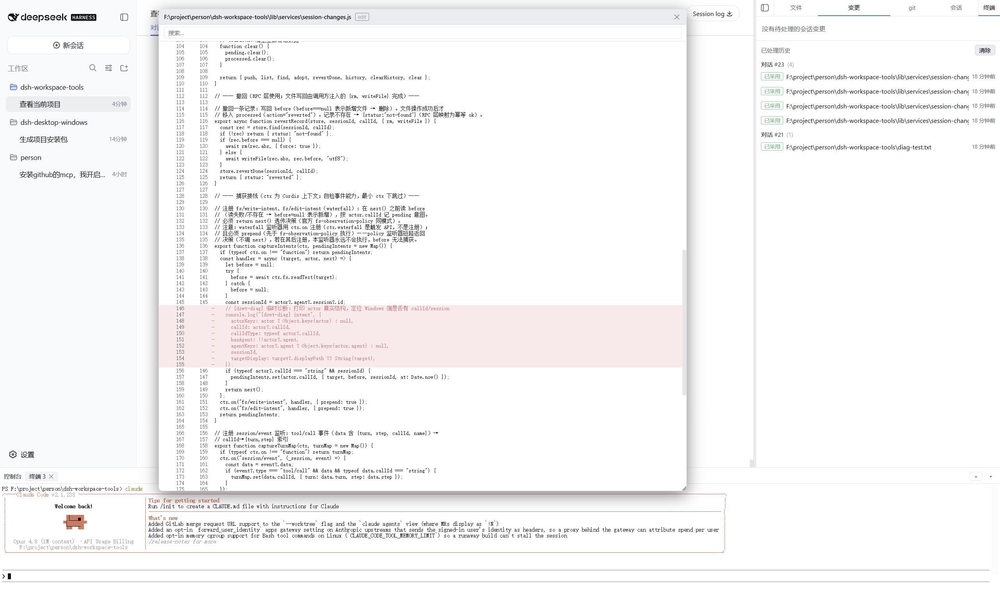

# dsh-workspace-tools

DSH（DeepSeek Harness）第三方插件：**右侧原生工具侧边栏** —— 文件系统浏览器 / Git 变更与 diff / 会话变更 / PTY 控制台，一站式补全 DSH 工作台。

## ✨ 亮点

- **上手即用**：`npm install` + 一条构建 + 一条安装脚本，右侧栏即刻拥有文件、git、diff、终端四大工具；不遮蔽主界面（与页面同层的 grid 布局），收起可缩成 56px 图标 rail。
- **Windows & macOS 一致可用**：Windows 直连 `node-pty`（conpty）跑起真实 PTY 终端，PowerShell/cmd 皆可；文件、git、提交、撤回全套可用。
- **全链路安全**：RPC 全部 fail-closed（`sessionId` + cwd 双重校验），只回环监听，diff/提交/撤回都在工作区路径内执行。
- **跟随 DSH 主题**：深浅色主题自动适配，终端 xterm 配色、侧边栏、浮窗全部读 DSH 语义色 token，无割裂感。

## 功能总览

### 📁 文件系统浏览器

懒加载文件树（隐藏 dotfiles）、一键过滤、单击选中，右键菜单直达**预览 / 复制绝对路径 / 发送到对话框**。



### 🔀 Git 变更与 diff

Git 变更列表（修改 / 新增 / 删除 / 重命名 / 未跟踪，目录分组），点击文件弹出行级 diff 浮窗——**可拖拽 / 缩放 / 搜索定位**；变更可勾选提交（单个或全部，必填提交消息），完整提交历史支持安全回退（`--mixed`）与提交详情 diff。



### 👁 diff 展示

统一 diff 浮窗组件：红删绿加、hunk 高亮、行号、全文搜索 + 高亮定位；文本预览（行号 + 语法高亮 + 搜索）与图片预览共用。



### 💬 会话变更

按「会话 → 对话 → 文件」记录 agent 每次 write/edit 的 before/after 快照，支持逐条**采用 / 撤回**（撤回恢复原内容、新增文件直接删除），与 git 完全解耦。

### 🖥 PTY 控制台

底部多标签 xterm 面板：WebSocket 输出流 + RPC 输入，可拖高、可收起（会话保留）。
- **POSIX**：`ctx.subprocess.spawnTerminal`
- **Windows**：dsh-subprocess 未实现 win32 inspector → 直连 `node-pty`（conpty），shell 探测 pwsh 7 / Windows PowerShell / cmd

## 技术要点

- **架构**：host 侧 `lib/`（RPC 端点 + WebSocket 泵 + git/fs/console 服务），client 侧 `src/`（React 组件，esbuild 打包为单文件 `client.js`）。
- **RPC 契约**：`(endpoint, payload)` → `{ok, value}` / `{ok, error}`；`sessionId` + cwd 校验（fail-closed）。
- **WS 协议**：client 发 masked 文本帧首帧（`{sessionId}`），host 回 PTY 输出 + `{"type":"exit"}` 退出帧；RFC6455 解析器。
- **控制台**：`ctx.subprocess.spawnTerminal`（POSIX）；Windows 直连 `node-pty`（conpty，插件根 `node_modules` junction → DSH profile 同实例；shell 探测 + PowerShell 系 `-NoLogo -NoExit` 参数，真机验证 2026-08-16）。

## 安装

```bash
npm install
node build.mjs        # 生成 client.js（xterm 等打包进 bundle）
node scripts/install.mjs   # 链接到 DSH profile + 写入 cordis.patch.yml（macOS symlink / Windows junction）
```

然后重启 DSH 服务（host 代码变更需重启；client.js 刷新即生效）。

## 开发

- 测试：`node --test`（85+ 用例，纯函数 + 集成 + bundle 加载契约）。
- 构建：`node build.mjs`（esbuild CJS wrapper；`react`/`@deepseek-ai/*` external，`@xterm/*` 打包，css 内联）。
- 设计文档：`docs/specs/2026-08-14-dsh-workspace-tools-design.md`。
- 里程碑计划：`docs/plans/`（M1 骨架 → M2 文件浏览器 → M3 变更/diff → M3b 预览 → M3c 变更 v2 → M3d 提交详情 → M4 控制台 → M5 Windows 适配）。

## 平台支持

| 平台 | 状态 |
|---|---|
| macOS | ✅ 完整可用（开发与验收平台） |
| Windows | ✅ 完整可用（M5-W）：文件/变更/预览/提交/控制台（node-pty conpty + 主题跟随）；junction 安装 |

## 许可

MIT
